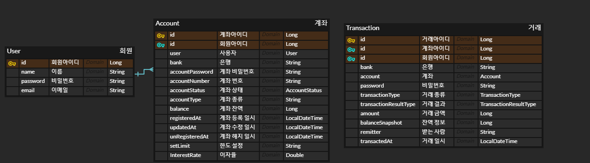

## 프로젝트 개요

### 프로젝트 정의
- 회원 로그인을 통해 계좌 생성, 해지, 검색 또는 입금, 인출, 송금 등의 간단한 기능을 가진 핀테크 프로잭트

### 기간
- 2023.06.12 ~ 2023.07.17

## 프로젝트 기능 및 API 명세
- 회원 관리
    - [ ] 로그인 
      - JWT토큰(유효 시간 30분)을 발행하여 로그인 시 계좌 접근이 허가되도록 한다.

- 계좌 (Account) 관리
    - 검색 시 계좌번호 인덱스 설계 (INDEX idxAccountNumber (accountNumber))
    - 개인 최대 보유 가능 계좌 예금 5개, 적금 5개

    - [ ] 계좌 생성
      - UUID를 통해 랜덤 번호를 통해 계좌번호를 생성 (10자리)
      
      - 헤더 : Authorization(로그인 토큰)
      - 요청 : POST ("/account/create")
      - 파라미터 : 비밀번호, 은행, 계좌종류(예금, 적금), 초기 잔액, 한도
      - 실패 응답 : 개인 당 최대 보유 가능 개수인 경우
      - 성공 응답 : 은행, 계좌 종류, 잔액, 한도, 등록일시, 계좌번호, 계좌상태
      
    - [ ] 계좌 해지 
      - 계좌번호를 통해 계좌를 해지
      - 헤더 : Authorization(로그인 토큰)
      - 요청 : DELETE ("/account/delete")
      - 파라미터 : 비밀번호, 계좌번호, 은행, 계좌 종류 
      - 실패 응답 : 은행이나 계좌타입이 일치하지 않는 경우, 이미 해지된 계좌, 잔액이 남은 계좌, 아이디와 소유주 다른 경우, 계좌번호가 일치하지 않는 경우, 사용자 또는 계좌가 없는 경우
      - 성공 응답 : 은행, 계좌 종류, 계좌번호, 해지일시, 계좌 상태
      
    - [ ] 계좌 검색
      - 로그인한 유저의 계좌 전체를 조회
      - 계좌번호를 통해 특정 계좌를 조회
        
      - 요청 : GET ("/account/search")
      - 헤더 : Authorization(로그인 토큰)
      - 파라미터 : 계좌 전체를 조회 >> 회원 아이디
                   특정 계좌 조회 >> 회원 아이디, 은행
      - 실패 응답 : 계좌가 없는 경우, 회원 아이디 또는 계좌번호가 잘못된 경우
      - 성공 응답 : 은행, 계좌 종류, 계좌번호, 계좌 상태, 계좌 잔액을 List 형식으로 응답

- 거래 (Transaction) 관리
    - 동시성 제어 : Redis의 lock을 통해 동시에 실행되는 작업이 있을 경우를 제어    

    - [ ] 금액 인출 
      - 요청 : POST ("/transaction/withdraw")
      - 헤더 : Authorization(로그인 토큰)
      - 요청 파라미터 : 계좌 아이디, 비밀번호, 은행, 계좌번호, 거래 종류, 거래 금액
      - 실패 응답 : 잔액보다 인출 금액이 큰 경우, 계좌 아이디 또는 비밀번호가 잘못된 경우, 이미 해지된 계좌인 경우
      - 성공 응답 : 거래 결과, 거래 금액, 잔액 정보, 거래 일시
        
    - [ ] 금액 입금 
      - 요청 : POST ("/transaction/deposit")
      - 헤더 : Authorization(로그인 토큰)
      - 요청 파라미터 : 계좌 아이디, 거래 종류, 거래 금액, 비밀번호
      - 실패 응답 : 입금 후 잔액이 한도 금액 이상인 경우, 계좌 아이디 또는 비밀번호가 잘못된 경우, 이미 해지된 계좌인 경우
      - 성공 응답 : 거래 결과, 거래 금액, 잔액 정보, 거래 일시
      
    - [ ] 송금 기능 
      - 요청 : POST ("/transaction/remittance")
      - 헤더 : Authorization(로그인 토큰)
      - 요청 파라미터 : 계좌 아이디, 거래 종류, 수금자 은행, 수금 계좌 번호, 수금 아이디, 거래 금액, 비밀번호
      - 실패 응답 : 수금자의 계좌번호와 수금자의 은행이 다를 경우, 송금액보다 잔액이 적은 경우, 계좌 아이디 또는 비밀번호가 다른 경우, 계좌가 사용중인 경우, 이미 해지된 계좌인 경우
      - 성공 응답 : 거래 결과, 거래 금액, 잔액 정보, 거래 일시
      
    - [ ] 거래 이력 조회
      - 해당 계좌의 전체 거래 이력 조회

      - 요청 : GET ("/transaction/remittance")
      - 헤더 : Authorization(로그인 토큰)
      - 요청 파라미터 : 계좌 아이디
      - 성공 응답 : 수금자 계좌 번호, 거래 종류, 거래 금액, 은행, 거래 결과, 거래 일시

## ERD

## 사용 기술 스택
- Java
- SpringBoot
- JPA
- H2 Database
- Embedded Redis
- Lombok
- Junit5
- Mockito
- JWT
- 
